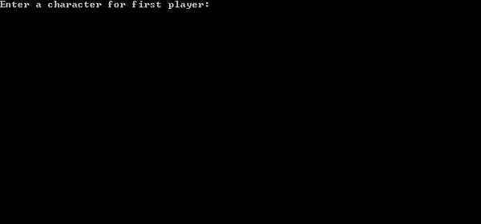

# Dots And Boxes

Dots And Boxes - 2017 (Python)

Dots and Boxes is a game played with 2 players on checkered paper. The game is played only in an area that is drawn. Players draw a non-drawn edge of a box within this area. If this edge is the last non-drawn edge of that box, the box is completed and belongs to the player who drew the last edge. The player can continue to draw edge as long as the box completes. The goal in the game is to have the maximum number of boxes.

When the program runs for the first time, 2 characters must be taken to represent the 2 players. The playing area must be minimum 3X3 and maximum 7X19. The rows of the playing field must be represented by numbers, columns with uppercase letters (Latin letters only) and the edges of each square with capital letters (E: east, W: west, N: north, S: south). So the correct input format should be as follows: "[row number] [column character] [direction]" for example 1 A S (row: 1, column: A, direction: South).

Dots And Boxes game doesn't require installation but does need to pre-installed Python.

<a href="https://github.com/onursert/DotsAndBoxes/raw/master/DotsAndBoxes.py">Download Dots And Boxes</a>
